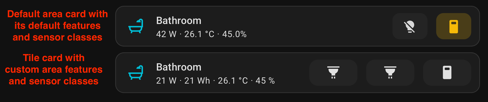

# Design rationale
This custom integration was created to deliver a room-level entity that works hand‑in‑hand with the [Custom Features for Home Assistant Cards](https://github.com/Nerwyn/custom-card-features) extension, allowing dashboards to mirror the Area card’s high‑level UX while remaining portable and source‑of‑truth agnostic, you are in control of areas' behavior. In addition, combining this integration with Custom Features for Home Assistant Cards unlocks more flexible card behaviors without being restricted to the Area logic and features. For example Area cards do not support showing a badge when a window is open, or when the AC is on, or changing the icon color based on temperature or humidity ranges. This integration exposes a stable schema that works well with Custom Features for Home Assistant Cards to implement these behaviors declaratively.

Why not just use Areas? Two reasons:

- Area entities aren’t first‑class, queryable sensors. They’re a grouping concept. Many dashboards still need a single, reactive entity per room that can provide a summary state and attributes for power, climate, occupancy, etc.
- The Area card’s behavior is great for overview dashboards, but it’s not easily reproducible across themes or custom dashboards without writing glue logic. This integration exposes a predictable sensor that pairs nicely with Custom Features for Home Assistant Cards’s rules and feature toggles.

The integration makes it straightforward to reproduce Area card behavior on a Tile card using Custom Features for Home Assistant Cards.

## Goals

- Provide a single sensor per room that reflects “Active/Idle/Unknown” status.
- Surface useful, typed attributes (numeric + display‑friendly) to power flexible dashboards and automations.
- Keep configuration simple: point to existing entities (power, energy, temp, humidity, motion, window, climate) without forcing a data model.
- Be resilient across HA versions by gracefully handling missing constants and entities.

## How it works

- A `sensor` entity is created per configured room. Its friendly name is the room name; suggested object_id is `room_<name>` so your entity_id becomes easy to reference in UI config and automations.
- The state logic prioritizes “occupied” signals:
  1) If motion is ON → `active`.
  2) Else, if power exceeds `active_threshold` (default 50W) → `active`.
  3) Else, if any core entity is configured → `idle`.
  4) Else → `unknown`.
- The icon reflects window or motion when relevant, otherwise falls back to a configurable or default icon.
- Attributes are exposed in two forms:
  - Raw numeric attributes for automations (e.g., `power_w`, `energy_wh`, `temperature_c`, `humidity_pct`, `climate_target_c`).
  - Human‑readable attributes with units for dashboards (e.g., `power`, `energy`, `temperature`, `humidity`, `climate_target`).
- A lightweight coordinator listens to state changes of the referenced entities and schedules updates for the summary sensor—no polling.

## Why this pairs well with Custom Features for Home Assistant Cards

Custom Features for Home Assistant Cards lets you declaratively toggle and compose per‑card features based on entity attributes, thresholds, and state. By centralizing room summary data in a single entity:

- You can implement area‑like tiles with conditions like “show occupied badge when `occupied` is true”, “show window alert when `window_open` is true”, or “color accent when `state == active` or `power_w > N`”.
- You avoid repetitive template sensors: dashboards read a consistent schema, regardless of which underlying devices a room has.
- Cards remain simple: fewer jinja templates, more declarative feature rules.

## Configuration surface

The integration accepts the following entity references per room:

- Power sensor (W)
- Energy sensor (Wh)
- Temperature sensor (°C)
- Humidity sensor (%)
- Motion binary_sensor
- Window/Contact binary_sensor
- Climate entity (for HVAC mode and target temperature)

Optional settings:

- `active_threshold`: Power threshold (W) to consider the room active when motion is off. Default: 50.0
- `icon`: Fallback icon when neither motion nor window is active.

## Design choices

- Non‑polling updates: Uses `async_track_state_change_event` to react immediately to changes.
- Friendly + machine attributes: Keep dashboards readable without sacrificing automation precision.
- Graceful fallbacks: If unit constants differ between HA versions, we fall back to safe string units (C, W, Wh).
- Minimal constraints: No enforced device model—just wire up what you already have.

## Limitations and future ideas

- Activity inference is intentionally simple (motion or power > threshold). Future options could include:
  - Time‑decay for motion (linger in `active` for N minutes after last motion)
  - Optional aggregation of multiple motion or power entities
  - Presence from BLE/Wi‑Fi trackers
- Add services to override state manually (e.g., force idle/active for a scene).
- More attributes for Custom Features for Home Assistant Cards features (e.g., comfort score, air quality if present).

## Example Custom Features for Home Assistant Cards usage

- Show a glowing border when `state == "active"`.
- Display a badge when `window_open` is true.
- Change icon color based on `humidity_pct` or `temperature_c` ranges.
- Conditionally reveal a secondary line like `power` or `climate_target` when present.

With a stable, documented schema, you can compose these behaviors per room without duplicating logic across cards.
